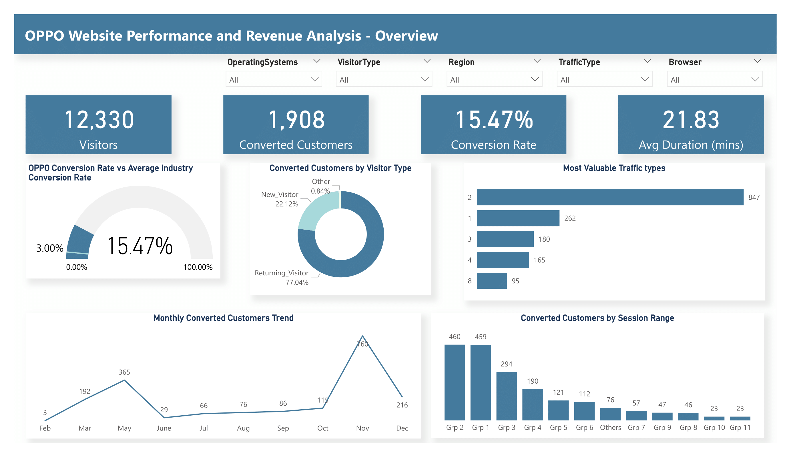
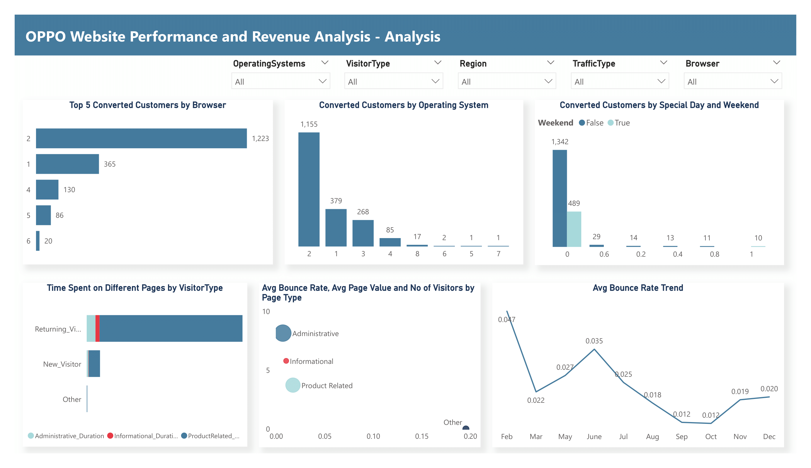

# OPPO Website Performance and Revenue Analysis

## Table of Contents

- [Business Problem](#business-problem)
- [Rationale for the Project](#rationale-for-the-project)
- [Aim of the Project](#aim-of-the-project)
- [Data Description](#data-description)
- [Tech Stack](#tech-stack)
- [Project Scope](#project-scope)
- [Analysis and Insights](#analysis-and-insights)
- [Recommendations](#recommendations)

## Business Problem
OPPO, an e-commerce business, seeks to understand how various factors influence its website's revenue and improve customer interaction. We have been contracted to provide detailed insights into customer web session from the data provided. This analysis will help OPPO's management team make data-driven decisions to grow the business.

## Rationale for the Project
E-commerce businesses thrive on understanding customer behavior and improving user experience. By analyzing web session data, OPPO can identify the key elements contributing to revenue and optimize the website’s performance. This project aims to provide OPPO with actionable insights into their website's traffic patterns, user interactions, and conversion factors.

## Aim of the Project
The primary aim of this project is to conduct an in-depth analysis of OPPO’s e-commerce website data using Power BI. This analysis will provide the management team with insights on:

- Factors driving revenue generation.
- How customers interact with the website.
- How web traffic, user types, and special events affect sales and conversions

## Data Description
The dataset consists of web session data with the following key attributes:

- Page Visit Data: Number of pages visited across different categories (Administrative, Informational, Product Related) and time spent on each.
- Bounce Rate: Percentage of visitors leaving without interacting further after landing on a page.
- Exit Rate: Percentage of pageviews that are the last in a session.
- Page Value: The average value of a page before completing a transaction.
- Special Day: Closeness of visit time to special days, like Valentine's Day.
- Visitor Info: Type of visitor (new or returning), operating system, browser, region, traffic source.
- Weekend: Boolean indicating whether the visit was during a weekend.
- Month: Month of the visit.

## Tech Stack
- Power BI: Used to analyze the data and create the dashboard.
- Power Query: To clean and transform the data.
- DAX (Data Analysis Expressions): For advanced calculations and metrics in Power BI.

## Project Scope
The scope of this project covers:

1. Cleaning and transforming the dataset using Power Query.
2. Developing visualizations in Power BI to explore session behaviors, traffic patterns, and key metrics.
3. Providing insights and recommendations to OPPO management regarding:
- Patterns of behavior between new and returning visitors.
- The influence of page visit types and durations on revenue.
- The impact of bounce rates, exit rates, and special days on conversion rates.

## Analysis and Insights
This report is made of of two pages:
- Overview Page
- Analysis Page

The full report can be found [here](https://app.powerbi.com/view?r=eyJrIjoiMTE5MTVmZDgtNzkyZi00YTlhLTljMzEtMzdhOWU4ZGY2ZmI3IiwidCI6IjBjODQwNDRjLTRmZDUtNGU4My1iYjczLWNiYjhjNjI3OGIyZiJ9)

### Overview

This page is a summary of the main drivers of customer conversion on the website, leading to revenue. It will give a quick, high-level overview and enable stakeholders and management know what is working and what needs to be improved.
- For the period in consideration (February to December, with April not available in the data), there were 12,330 visitors to the website.
- Out of these visitors, 1,908 were converted i.e bought a product, leading to a conversion rate of 15.47%. The average time spent by visitors on the website is approximately 22 minutes.
- We compared our conversion rate to the industry standard (3%), meaning that the Company is doing 12.47% better than the average standard in the indusry.
- We see that customeers who are returning are responsible for 77% of our conversions, suggesting effective retention strategies.
- Traffic Type 2 brings in the most converted customers, making it effective in attracting valuable traffic.
- February is our worst month, with conversions inceasing until May and then decreasing the next month. There's a steady increase until October when there is a huge bump to November, making it our best conversion month.
- Visitors spending between 20 - 30 mins or below on the website are most likely to convert, indicating optimal engagement time. These are represented by Groups 1 to 3.

### Analysis

Here, the focus is on the revenue drivers and customer behaviour.
- Investigating the technical aspects thst drive our conversions, we see that Browser 2 and Operating System 2 lead in terms of converted customers, indicating technical preferences of our high-value users.
- Special Day 0, particularly on Week days show significantly higher conversion rates.
- Returning Visitors spent nore time on Product Related pages, which may account for some of the conversions on the website.
- Administrative Page is our most valuable page, with the lowest exit rate and highest page values.
- On the average, February has the highest bounce rate, explaining why we have the lowest conversion rates in this month.

### Recommendations

- Implement A/B testing on all pages to improve overall conversion rate.
- Optimize the user journey to encourage the user to spend about between 1 and 20 minutes on the website, as this correlates with higher conversion rates.
- Allocate more resources to Traffic Type 2 to capitalize on it's effectiveness in bringing converted customers.
- Develop targeted campaigns for Returning Customers to further enhance the performance of this high-converting segment.
- Prioritize website optimization of Browser 2 and Operating System 2 to address the preference of high-converting customers.
- Conduct usability testing on less performing Browsers and Operating Systems to identify and address any issues.
- Align marketing efforts and promotions with high-converting periods, particularly Special Day 0 Weekdays.
- Develop strategies to boost conversions on all other low-performing periods.
- Develop personalized user experiences based on Visitor Type, Traffic source, and Browsing behavior to enhance user engagement and conversion rates.
- Set up alerts for significant deviations in conversion rates or traffic patterns to enable quick responses to changes in user behavior or technical problems.

